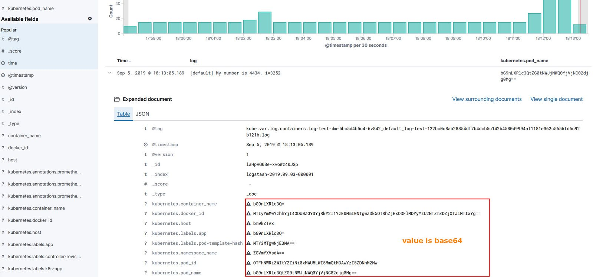

## 说明

[fluent-bit](https://docs.fluentbit.io/manual/)是Linux、OSX和BSD系列操作系统的快速、轻量级日志处理器和转发器。它非常注重性能，允许从不同的源收集事件而不必复杂，可以用来替换fluend。

由于官方的fluent-bit不支持redis插件，github有人使用go语言编写了fluent-bit的[redis插件](https://github.com/majst01/fluent-bit-go-redis-output)，可以用来采集节点和容器日志，但是用来采集kubernetes集群日志时，多级json的值出现base64编码，不能直接查看原来的值,如下图所示：



<br>

原因go语言的json序列化时，[]byte类型自动使用了base64编码，而不是string，解决办法是数据在序列化前把[]byte类型统一转为string，具体实现如下

```go
func bytes2string(record map[interface{}]interface{}) map[string]interface{} {
    m := make(map[string]interface{})

    for k, v := range record {
        switch t := v.(type) {
        case []byte:
			// prevent encoding to base64
            m[k.(string)] = string(t)
        case map[interface{}]interface{}:
            m[k.(string)] = bytes2string(v.(map[interface{}]interface{}))
        }
        default:
            m[k.(string)] = v
    }

    return m
}
```

<br>

## 构建镜像

> docker build -t fluent-bit-redis:latest

<br>

## 使用

### 采集容器日志

### 采集k8s日志
